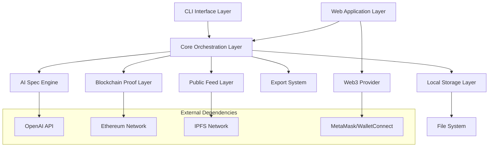
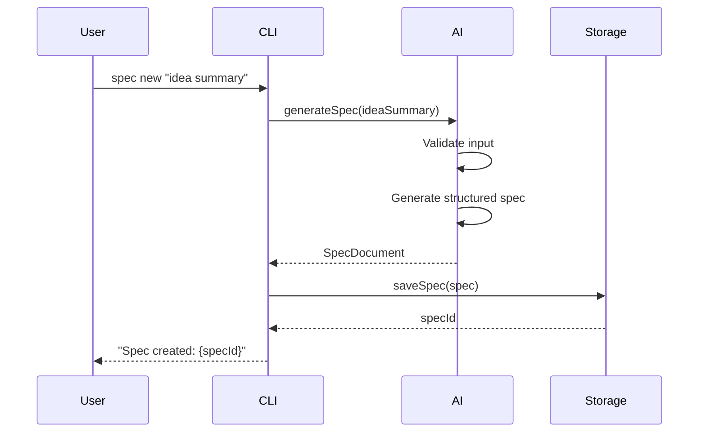
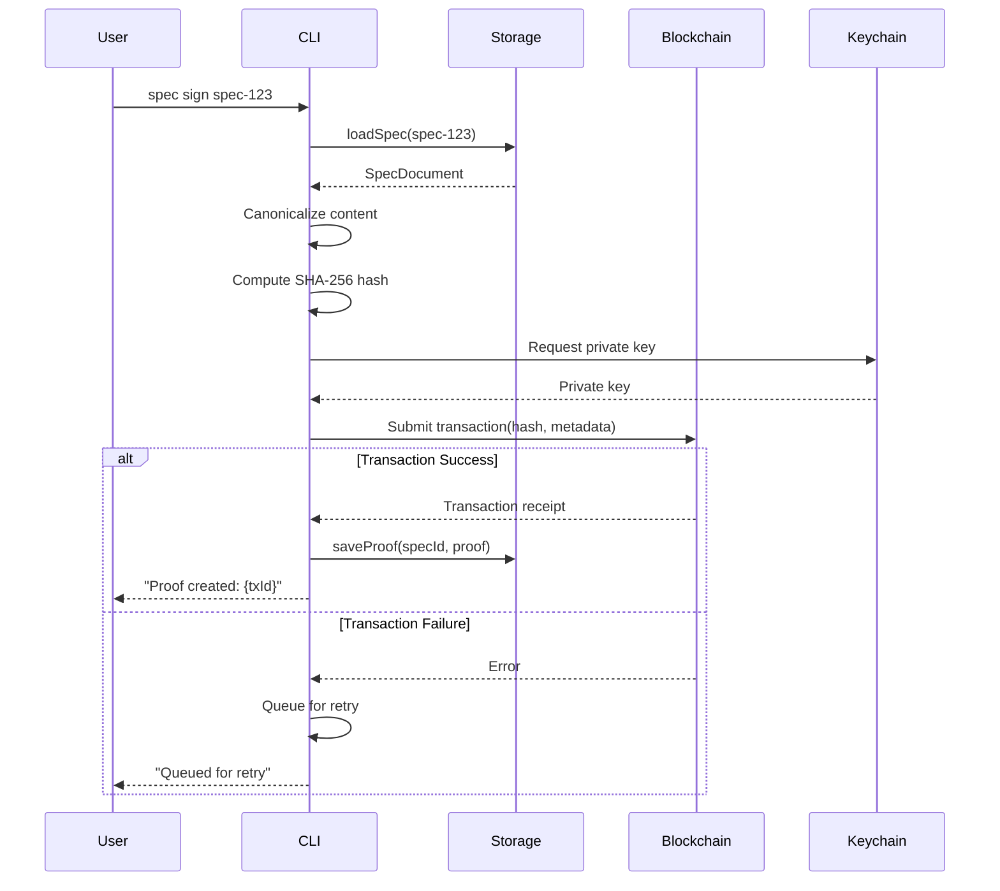
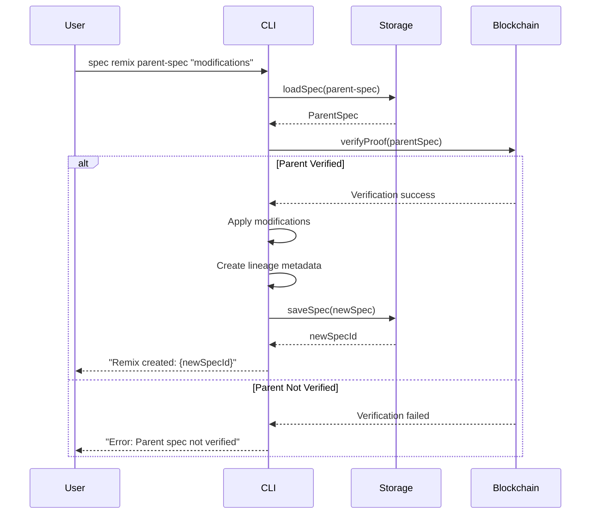

# SpecChain Pro - Design Document

## Overview

SpecChain Pro is an AI-powered CLI tool that transforms idea summaries into structured software specifications and provides blockchain-based proof-of-authorship. The system consists of several key components working together to provide a seamless experience from idea conception to verified specification.

The architecture follows a modular design with clear separation between the CLI interface, AI processing, blockchain operations, and local storage. This design ensures maintainability, testability, and extensibility while providing robust error handling and offline capabilities.

## Architecture

The system uses a layered architecture with the following main components:



### Component Responsibilities

**CLI Interface Layer**: Handles command parsing, user interaction, and output formatting. Provides intuitive commands like `spec new`, `spec sign`, `spec verify`, and `spec export`.

**Web Application Layer**: Modern React-based web interface inspired by MetaMask's design. Provides visual spec creation, wallet integration, blockchain interaction, and public feed browsing with responsive design and dark/light themes.

**Core Orchestration Layer**: Coordinates between all other components, manages workflow state, and handles cross-cutting concerns like error handling and configuration.

**AI Spec Engine**: Interfaces with AI services to transform idea summaries into structured specifications. Handles prompt engineering, response parsing, and output normalization.

**Blockchain Proof Layer**: Manages cryptographic hashing, blockchain transactions, and proof verification. Supports multiple networks (testnet/mainnet) and handles network failures gracefully.

**Local Storage Layer**: Provides persistent storage for specs, metadata, and configuration. Maintains version history and enables offline operation.

**Export System**: Converts specs between different formats (Markdown, JSON, GitHub issues) while preserving structure and metadata.

**Public Feed Layer**: Enables discovery and sharing of public specs through IPFS-based indexing and search capabilities.

## Components and Interfaces

### CLI Interface Layer

```typescript
interface CLICommand {
  name: string;
  description: string;
  options: CLIOption[];
  handler: (args: CLIArgs) => Promise<CLIResult>;
}

interface CLIArgs {
  command: string;
  options: Record<string, any>;
  positional: string[];
}

interface CLIResult {
  success: boolean;
  message: string;
  data?: any;
}
```

**Key Commands:**
- `spec new [idea-summary]` - Generate new spec from idea
- `spec sign [spec-file]` - Create blockchain proof
- `spec verify [spec-file]` - Verify against blockchain
- `spec export [format] [spec-file]` - Export to different formats
- `spec remix [parent-spec] [modifications]` - Create attributed remix
- `spec feed [search-terms]` - Browse public specs

### Web Application Layer

```typescript
interface WebAppState {
  user: UserProfile;
  wallet: WalletConnection;
  specs: SpecDocument[];
  feed: SpecSummary[];
  theme: 'light' | 'dark';
}

interface WalletConnection {
  address: string;
  chainId: number;
  provider: 'metamask' | 'walletconnect' | 'coinbase';
  connected: boolean;
}

interface UserProfile {
  address: string;
  displayName?: string;
  avatar?: string;
  specsCreated: number;
  specsVerified: number;
}
```

**Design Inspiration (MetaMask-style):**
- **Hero Section**: Bold gradient background with clear value proposition and "Get Started" CTA
- **Wallet Connection**: Prominent "Connect Wallet" button with multi-provider support
- **Card-Based UI**: Spec cards with hover effects, verification badges, and quick actions
- **Color Palette**: Modern gradients (purple/blue), high contrast, accessibility-focused
- **Typography**: Clean sans-serif (Inter/SF Pro), clear hierarchy
- **Animations**: Smooth transitions, loading states, success/error feedback
- **Responsive**: Mobile-first design with breakpoints for tablet/desktop

**Key Pages:**
1. **Home/Landing**: Hero section, features overview, stats dashboard
2. **Create Spec**: Multi-step form with AI generation preview
3. **My Specs**: Personal spec library with filters and search
4. **Spec Detail**: Full spec view with lineage graph, proof details, actions
5. **Public Feed**: Discover specs with search, filters, trending
6. **Wallet**: Account management, transaction history, settings

**Technology Stack:**
- **Frontend**: React 18+ with TypeScript
- **Styling**: Tailwind CSS for utility-first styling
- **State Management**: Zustand or Redux Toolkit
- **Web3 Integration**: wagmi + viem for wallet connection and blockchain interaction
- **Routing**: React Router v6
- **UI Components**: Radix UI or shadcn/ui for accessible components
- **Charts**: Recharts for lineage visualization
- **Animations**: Framer Motion for smooth transitions

### AI Spec Engine

```typescript
interface AISpecEngine {
  generateSpec(ideaSummary: string, options?: GenerationOptions): Promise<SpecDocument>;
  validateInput(ideaSummary: string): ValidationResult;
  normalizeOutput(rawSpec: string): SpecDocument;
}

interface GenerationOptions {
  template?: string;
  includeImplementation?: boolean;
  targetAudience?: 'technical' | 'business' | 'mixed';
}

interface SpecDocument {
  title: string;
  overview: string;
  requirements: Requirement[];
  architecture: string;
  implementation: string;
  metadata: SpecMetadata;
}
```

**AI Integration Strategy:**
- Primary: OpenAI GPT-4 for high-quality spec generation
- Fallback: Local models via Ollama or LM Studio (Llama-3.1-8B, Mistral-7B) for offline operation
- Local provider adapter maintains consistent prompt templates between remote and local
- Prompt engineering with structured templates shared across providers
- Response validation and normalization
- Graceful degradation: Full offline capability with local models

### Blockchain Proof Layer

```typescript
interface BlockchainProofLayer {
  createProof(spec: SpecDocument): Promise<ProofResult>;
  verifyProof(spec: SpecDocument, proofId: string): Promise<VerificationResult>;
  queryProofs(criteria: ProofQuery): Promise<ProofRecord[]>;
}

interface ProofResult {
  transactionId: string;
  blockHash: string;
  timestamp: Date;
  specHash: string;
  networkId: string;
}

interface VerificationResult {
  isValid: boolean;
  originalAuthor: string;
  creationTimestamp: Date;
  blockchainRecord: ProofRecord;
}
```

**Blockchain Strategy:**
- Development: Ethereum testnet (Sepolia) for initial testing
- Production: **Layer 2 networks as default** (Base, Polygon, Arbitrum, Optimism) to minimize gas fees (< $0.01 per proof) and achieve near-instant confirmations
- Ethereum mainnet remains supported for users requiring maximum security/decentralization
- Hash algorithm: SHA-256 for spec content with canonicalization (normalized line endings, sorted JSON keys, stripped whitespace)
- Smart contract for proof storage and retrieval with event emission
- **Batching support**: Queue multiple proofs and submit in batches to further reduce costs
- Alternative storage: Support for Arweave (pay-once permanent storage) for long-term archival
- Retry logic with exponential backoff and circuit breaker pattern

### Local Storage Layer

```typescript
interface StorageLayer {
  saveSpec(spec: SpecDocument): Promise<string>;
  loadSpec(specId: string): Promise<SpecDocument>;
  listSpecs(filter?: SpecFilter): Promise<SpecSummary[]>;
  deleteSpec(specId: string): Promise<void>;
  saveProof(specId: string, proof: ProofResult): Promise<void>;
}

interface SpecMetadata {
  id: string;
  author: string;
  createdAt: Date;
  modifiedAt: Date;
  version: string;
  parentSpec?: string;
  blockchainProof?: ProofResult;
  tags: string[];
}
```

**Storage Strategy:**
- File-based storage in user's home directory
- JSON format for metadata, Markdown for content
- Atomic writes to prevent corruption
- Index file for fast lookups
- Version history with diff tracking

### Export System

```typescript
interface ExportSystem {
  exportToMarkdown(spec: SpecDocument): string;
  exportToJSON(spec: SpecDocument): object;
  exportToGitHubIssue(spec: SpecDocument): GitHubIssue;
  validateFormat(format: ExportFormat): boolean;
}

interface GitHubIssue {
  title: string;
  body: string;
  labels: string[];
  assignees?: string[];
}
```

### Public Feed Layer

```typescript
interface PublicFeedLayer {
  publishSpec(spec: SpecDocument): Promise<PublicationResult>;
  searchSpecs(query: SearchQuery): Promise<SpecSummary[]>;
  getSpecFeed(options?: FeedOptions): Promise<SpecSummary[]>;
}

interface SearchQuery {
  terms: string;
  author?: string;
  tags?: string[];
  verified?: boolean;
  dateRange?: DateRange;
}
```

**Implementation Strategy:**
- **Storage**: IPFS for decentralized content storage with content-addressed CIDs
- **Indexing**: Lightweight centralized indexer (hosted on Vercel/AWS) that crawls published IPFS CIDs and maintains searchable metadata
- **Alternative**: Integration with The Graph protocol or SubQuery for decentralized indexing
- **MVP Approach**: Local caching with manual CID sharing; centralized indexer added post-MVP
- **Privacy**: Publishing to public feed is opt-in and separate from private anchoring. Private proofs store only the hash on-chain; full spec content remains local unless explicitly published
- **Search Ranking**: Relevance scoring based on text matching, recency, and verification status
- **Fallback**: Local cache provides results when network unavailable

## Data Models

### Core Data Structures

```typescript
// Primary spec document structure
interface SpecDocument {
  metadata: SpecMetadata;
  content: SpecContent;
  proof?: BlockchainProof;
  lineage?: SpecLineage;
}

interface SpecContent {
  title: string;
  overview: string;
  requirements: Requirement[];
  architecture: ArchitectureSection;
  implementation: ImplementationNotes;
  tags: string[];
}

interface Requirement {
  id: string;
  title: string;
  description: string;
  priority: 'High' | 'Medium' | 'Low';
  acceptanceCriteria: string[];
  userStory?: string;
}

interface BlockchainProof {
  transactionId: string;
  blockHash: string;
  specHash: string;
  timestamp: Date;
  networkId: string;
  layer2Network?: string;
  gasUsed?: number;
  batchId?: string;
}

interface SpecLineage {
  parentSpecId?: string;
  parentProofId?: string;
  modifications: SpecDiff[];
  remixReason: string;
  originalAuthor: string;
}

interface SpecDiff {
  section: string;
  operation: 'add' | 'remove' | 'modify';
  before?: string;
  after?: string;
  timestamp: Date;
}
```

### Configuration Model

```typescript
interface AppConfig {
  ai: AIConfig;
  blockchain: BlockchainConfig;
  storage: StorageConfig;
  export: ExportConfig;
  user: UserConfig;
}

interface AIConfig {
  provider: 'openai' | 'local';
  apiKey?: string;
  model: string;
  temperature: number;
  maxTokens: number;
  customPrompts?: Record<string, string>;
  localProvider?: 'ollama' | 'lmstudio';
  localModel?: string;
}

interface BlockchainConfig {
  network: 'testnet' | 'mainnet' | 'layer2';
  layer2Provider?: 'base' | 'polygon' | 'arbitrum' | 'optimism';
  rpcUrl: string;
  contractAddress: string;
  gasLimit: number;
  batchingEnabled: boolean;
  batchSize?: number;
  keyManagement: 'keychain' | 'hardware' | 'env';
}
```

**Default Configuration Example:**
```json
{
  "ai": {
    "provider": "openai",
    "model": "gpt-4",
    "temperature": 0.7,
    "maxTokens": 2000,
    "localProvider": "ollama",
    "localModel": "llama-3.1-8b"
  },
  "blockchain": {
    "network": "layer2",
    "layer2Provider": "base",
    "rpcUrl": "https://mainnet.base.org",
    "contractAddress": "0x...",
    "gasLimit": 500000,
    "batchingEnabled": true,
    "batchSize": 10,
    "keyManagement": "keychain"
  },
  "storage": {
    "basePath": "~/.specchain",
    "maxVersionHistory": 50
  },
  "user": {
    "name": "",
    "email": "",
    "defaultTags": []
  }
}
```

### Error Handling Model

```typescript
interface SpecChainError {
  code: ErrorCode;
  message: string;
  details?: any;
  recoverable: boolean;
  suggestedAction?: string;
}

enum ErrorCode {
  // AI Errors (4xx - User/Input Related)
  AI_GENERATION_FAILED = 'AI_001',
  AI_INVALID_INPUT = 'AI_002',
  AI_RATE_LIMIT = 'AI_003',
  
  // Blockchain Errors (5xx - System/Network Related)
  BLOCKCHAIN_NETWORK_ERROR = 'BC_001',
  BLOCKCHAIN_TRANSACTION_FAILED = 'BC_002',
  BLOCKCHAIN_INSUFFICIENT_FUNDS = 'BC_003',
  BLOCKCHAIN_VERIFICATION_FAILED = 'BC_004',
  
  // Storage Errors (5xx - System Related)
  STORAGE_WRITE_FAILED = 'ST_001',
  STORAGE_READ_FAILED = 'ST_002',
  STORAGE_PERMISSION_DENIED = 'ST_003',
  STORAGE_DISK_FULL = 'ST_004',
  
  // Export Errors (4xx - User Related)
  EXPORT_FORMAT_INVALID = 'EX_001',
  EXPORT_CONVERSION_FAILED = 'EX_002',
  
  // Configuration Errors (4xx - User Related)
  CONFIG_INVALID = 'CF_001',
  CONFIG_MISSING = 'CF_002',
  
  // Network Errors (5xx - System Related)
  NETWORK_TIMEOUT = 'NT_001',
  NETWORK_UNAVAILABLE = 'NT_002'
}
```

## Security Considerations

### Key Management
**Critical Security Requirement**: Private keys are never stored in plaintext.

**Implementation Approach:**
- **OS Keychain Integration**: Use platform-specific secure storage
  - macOS: Keychain Access
  - Windows: Credential Vault
  - Linux: libsecret/pass
- **Hardware Wallet Support**: Integration via ethers.js for Ledger/Trezor devices
- **Environment Variables**: Fallback option with clear security warnings
- **First-Run Warning**: On first `spec sign` command, display security notice about key management best practices

### Threat Model
- **Key Compromise**: If private key is stolen, attacker can create false proofs. Mitigation: Hardware wallet support, keychain encryption
- **Replay Attacks**: Old transactions could be replayed. Mitigation: Include nonce and timestamp in smart contract
- **Hash Collision**: SHA-256 collision could allow proof forgery. Mitigation: Use SHA-256 (collision-resistant), consider upgrading to SHA-3 in future
- **MITM Attacks**: Network interception could modify specs. Mitigation: HTTPS/TLS for all network communications, verify blockchain receipts
- **Local Data Tampering**: Attacker modifies local specs. Mitigation: Blockchain verification detects tampering

### Privacy Considerations
- **Private by Default**: Blockchain proofs store only hashes, not full content
- **Opt-in Publishing**: Public feed requires explicit user consent
- **Metadata Leakage**: Timestamps and author info are public on-chain
- **PII Handling**: Warn users not to include sensitive data in public specs

## Workflow Sequence Diagrams

### Spec Creation Flow


### Blockchain Signing Flow


### Spec Remix Flow


## Hash Canonicalization

To ensure consistent hashing across different systems and prevent false tampering detection:

**Canonicalization Rules:**
1. **Line Endings**: Normalize all line endings to `\n` (Unix-style)
2. **Trailing Whitespace**: Strip trailing whitespace from all lines
3. **JSON Metadata**: Sort object keys alphabetically before serialization
4. **Encoding**: Use UTF-8 encoding consistently
5. **Timestamp Format**: ISO 8601 format with UTC timezone

**Implementation:**
```typescript
function canonicalizeSpec(spec: SpecDocument): string {
  // Sort metadata keys
  const sortedMetadata = sortObjectKeys(spec.metadata);
  
  // Normalize content
  const normalizedContent = spec.content
    .split('\n')
    .map(line => line.trimEnd())
    .join('\n');
  
  // Combine and encode
  return JSON.stringify({
    metadata: sortedMetadata,
    content: normalizedContent
  }, null, 0); // No pretty-printing for consistency
}
```
## Correctness Properties

*A property is a characteristic or behavior that should hold true across all valid executions of a system—essentially, a formal statement about what the system should do. Properties serve as the bridge between human-readable specifications and machine-verifiable correctness guarantees.*

**Testing Configuration**: All properties will be implemented as fast-check tests with ≥100 runs and realistic generators (using faker-js for idea summaries, ethers.js for addresses, etc.).

### AI Spec Engine Properties

### Property 1: AI Spec Generation Consistency
*For any* valid idea summary, the AI_Spec_Engine should generate a structured Markdown specification that includes overview, requirements, architecture, and implementation sections with consistent formatting across all outputs.
**Validates: Requirements 1.1, 1.2, 1.4**

### Property 2: AI Input Validation
*For any* input string, the AI_Spec_Engine should validate that it contains sufficient detail for spec generation and reject inputs that are too short or lack meaningful content.
**Validates: Requirements 1.5**

### Property 3: AI Error Handling
*For any* AI generation failure, the system should return a descriptive error message and preserve the original input for retry.
**Validates: Requirements 1.3**

### Blockchain & Cryptography Properties

### Property 4: Cryptographic Hash Consistency
*For any* spec document, computing the cryptographic hash should produce the same result when called multiple times on identical content.
**Validates: Requirements 2.1, 3.1**

### Property 5: Hash Idempotency
*For any* spec document, canonicalizing and hashing the content multiple times should always produce identical results regardless of system or timestamp.
**Validates: Requirements 2.1**

### Property 6: Blockchain Proof Creation
*For any* spec document, creating a blockchain proof should store the hash on the blockchain with timestamp and author information, returning a valid transaction ID.
**Validates: Requirements 2.2, 2.4**

### Property 7: Blockchain Retry Logic
*For any* blockchain operation failure, the system should retry with exponential backoff up to a maximum number of attempts and provide clear error messages.
**Validates: Requirements 2.3, 10.1**

### Property 8: Local Spec Preservation
*For any* spec document, creating a blockchain proof should preserve the original spec content locally for future reference.
**Validates: Requirements 2.5**

### Property 9: Verification Hash Matching
*For any* spec document with a valid blockchain proof, verification should confirm authenticity when hashes match and indicate tampering when they don't.
**Validates: Requirements 3.3, 3.4**

### Property 10: Blockchain Query Error Handling
*For any* blockchain query failure, the system should distinguish between network errors and missing proofs, providing appropriate error messages.
**Validates: Requirements 3.2, 3.5**

### CLI & User Interface Properties

### Property 11: CLI Command Usability
*For any* CLI command, the system should provide clear help text and actionable error messages with suggested next steps when commands fail.
**Validates: Requirements 4.5, 4.6**

### Export System Properties

### Property 12: Export Format Fidelity
*For any* spec document and export format (Markdown, JSON, GitHub), the export should preserve all content structure and include required metadata fields specific to that format.
**Validates: Requirements 5.1, 5.2, 5.3**

### Property 13: Export Format Validation
*For any* export request, the system should validate format compatibility before processing and preserve the original spec when export fails.
**Validates: Requirements 5.4, 5.5**

### Remix & Lineage Properties

### Property 14: Remix Attribution Preservation
*For any* spec remix operation, the system should preserve original author attribution and record the parent spec's blockchain anchor in lineage metadata.
**Validates: Requirements 6.1, 6.2**

### Property 15: Lineage Chain Completeness
*For any* spec with lineage, displaying the lineage should show the complete chain of modifications from original to current version.
**Validates: Requirements 6.3**

### Property 16: Remix Blockchain Anchoring
*For any* remixed spec, the system should generate new blockchain anchors while maintaining parent references.
**Validates: Requirements 6.4**

### Property 17: Remix Failure Prevention
*For any* lineage tracking failure, the system should prevent remix creation and explain attribution requirements.
**Validates: Requirements 6.5**

### Public Feed Properties

### Property 18: Public Feed Indexing
*For any* published spec, the public feed should index it for search and discovery with proper ranking by relevance and recency.
**Validates: Requirements 7.1, 7.2**

### Property 19: Feed Display Completeness
*For any* feed result, the display should include spec title, author, creation date, and blockchain verification status.
**Validates: Requirements 7.3**

### Property 20: Feed Filtering Functionality
*For any* search query with filters (tags, author, verification status), the feed system should return only specs matching all specified criteria.
**Validates: Requirements 7.4**

### Property 21: Feed Fallback Behavior
*For any* feed query failure, the system should provide fallback results from local cache when available.
**Validates: Requirements 7.5**

### Storage Properties

### Property 22: Storage Consistency and Integrity
*For any* spec document, saving and loading should preserve all content and metadata intact, with consistent naming conventions and proper version history tracking.
**Validates: Requirements 8.1, 8.2, 8.5**

### Property 23: Storage Error Handling
*For any* storage operation failure, the system should provide clear error messages about disk space or permissions issues.
**Validates: Requirements 8.3**

### Property 24: Storage Index Maintenance
*For any* local spec operation, the storage layer should maintain an accurate index for quick retrieval.
**Validates: Requirements 8.4**

### Configuration Properties

### Property 25: Configuration Validation
*For any* configuration change, the system should validate settings before applying and revert to defaults with warnings for invalid configurations.
**Validates: Requirements 9.2, 9.5**

### Property 26: Configuration Feature Support
*For any* supported configuration option (blockchain network, AI templates), the system should properly apply the settings and use them in operations.
**Validates: Requirements 9.3, 9.4**

### Error Recovery Properties

### Property 27: AI Failure Recovery
*For any* AI generation failure, the system should preserve the input and allow manual retry without data loss.
**Validates: Requirements 10.2**

### Property 28: Blockchain Transaction Queuing
*For any* blockchain operation failure, the system should queue transactions for later retry when network connectivity is restored.
**Validates: Requirements 10.3**

### Property 29: Error Logging Completeness
*For any* error condition, the error handler should log sufficient detail for debugging and provide recovery instructions for critical errors.
**Validates: Requirements 10.4, 10.5**

### Offline Operation Properties

### Property 30: Offline Operation Support
*For any* local operation (spec creation, editing, local verification), the system should function correctly without network access, using local AI models and cached data.
**Validates: Non-Functional Requirements - Usability**

### Web Application Properties

### Property 31: Wallet Connection Integrity
*For any* wallet connection attempt, the web application should properly detect the provider, establish connection, and maintain session state across page refreshes.
**Validates: Requirements 11.3, 11.5**

### Property 32: Web UI Responsiveness
*For any* screen size or device, the web application should render correctly with proper layout, readable text, and accessible interactive elements.
**Validates: Requirements 11.1, 11.7**

### Property 33: Real-time Generation Preview
*For any* idea input during spec creation, the web application should provide visual feedback and preview of AI generation progress.
**Validates: Requirements 11.2**

### Property 34: Blockchain Transaction Feedback
*For any* blockchain operation initiated from the web app, the system should display clear transaction status, progress indicators, and completion confirmation.
**Validates: Requirements 11.3**

### Property 35: Web Error Handling
*For any* error condition in the web application, the system should display user-friendly error messages with suggested actions and recovery options.
**Validates: Requirements 11.8**

## Error Handling

The system implements comprehensive error handling across all components with the following strategies:

### Error Classification
- **Recoverable Errors**: Network timeouts, temporary AI service unavailability, blockchain congestion
- **User Errors**: Invalid input, missing files, configuration errors
- **System Errors**: Disk full, permission denied, corrupted data
- **Critical Errors**: Data corruption, security breaches, system crashes

### Retry Strategies
- **Exponential Backoff**: For network operations with jitter to prevent thundering herd
- **Circuit Breaker**: For AI services to prevent cascading failures
- **Queue-based Retry**: For blockchain operations that can be deferred
- **Manual Retry**: For user-initiated operations that require intervention

### Error Recovery
- **Graceful Degradation**: Offline mode when network services unavailable
- **Data Preservation**: Always preserve user input during failures
- **State Rollback**: Atomic operations with rollback on partial failures
- **User Guidance**: Clear instructions for manual recovery steps

### Logging Strategy
- **Structured Logging**: JSON format with correlation IDs
- **Log Levels**: ERROR, WARN, INFO, DEBUG with configurable verbosity
- **Sensitive Data**: Redaction of private keys and personal information
- **Retention**: Configurable log rotation and retention policies

## Testing Strategy

The testing approach combines unit tests for specific scenarios with property-based tests for comprehensive coverage:

### Unit Testing
- **Component Isolation**: Mock external dependencies (AI APIs, blockchain networks)
- **Edge Cases**: Empty inputs, malformed data, boundary conditions
- **Error Scenarios**: Network failures, invalid configurations, permission errors
- **Integration Points**: CLI command parsing, file system operations, configuration loading
- **Performance Validation**: Ensure AI generation completes within 30 seconds, blockchain operations timeout at 60 seconds, local storage operations complete within 2 seconds (per non-functional requirements)

### Property-Based Testing
- **Minimum 100 iterations** per property test to ensure statistical confidence
- **Random Input Generation**: Fuzz testing with realistic data generators (faker-js for text, ethers.js for blockchain data)
- **Invariant Verification**: Properties that must hold across all valid inputs
- **Regression Prevention**: Automated detection of behavior changes
- **Shrinking**: Automatic minimization of failing test cases to simplest counterexample

### Test Configuration
Each property-based test will be tagged with the format:
**Feature: specchain-pro, Property {number}: {property_text}**

Example test structure:
```typescript
describe('Feature: specchain-pro, Property 1: AI Spec Generation Consistency', () => {
  it('should generate consistent structured specs for any valid idea summary', async () => {
    // Property-based test with 100+ iterations
    await fc.assert(fc.asyncProperty(
      fc.string({ minLength: 10, maxLength: 1000 }),
      async (ideaSummary) => {
        const spec = await aiEngine.generateSpec(ideaSummary);
        expect(spec).toHaveProperty('overview');
        expect(spec).toHaveProperty('requirements');
        expect(spec).toHaveProperty('architecture');
        expect(spec).toHaveProperty('implementation');
        expect(spec.content).toMatch(/^# .+/); // Markdown format
      }
    ), { numRuns: 100 });
  });
});
```

### Testing Tools
- **Unit Testing**: Jest for TypeScript/Node.js testing
- **Property Testing**: fast-check library for property-based testing
- **Mocking**: Mock blockchain networks (Hardhat/Ganache) and AI services for deterministic tests
- **Integration**: Docker containers for end-to-end testing scenarios
- **Performance**: Benchmark.js for performance regression testing

### Continuous Integration
- **Automated Testing**: All tests run on every commit
- **Performance Benchmarks**: Track AI generation (<30s), blockchain operations (<60s timeout), and storage operations (<2s) against non-functional requirements
- **Security Scanning**: Static analysis for vulnerabilities (npm audit, Snyk)
- **Dependency Auditing**: Regular security updates for dependencies
- **Coverage Targets**: Minimum 80% code coverage, 100% property coverage